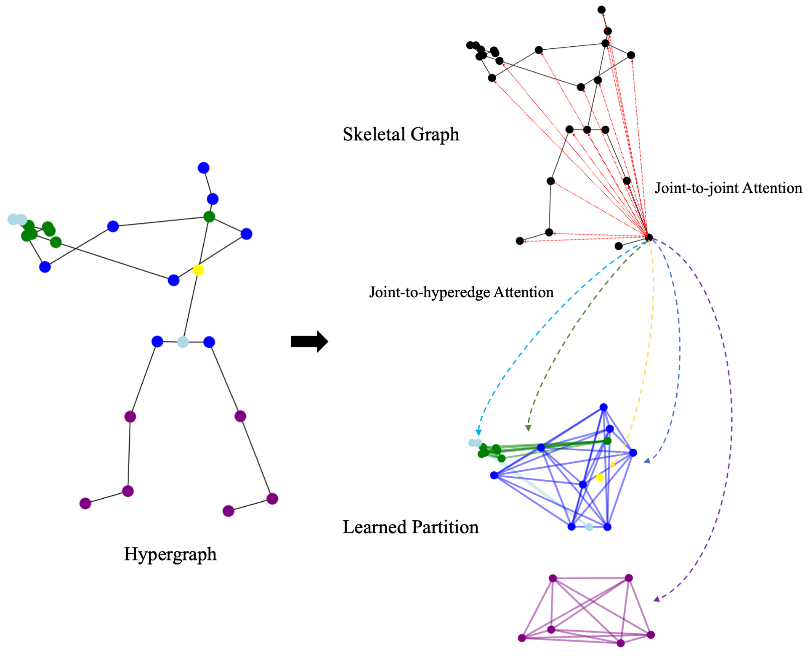
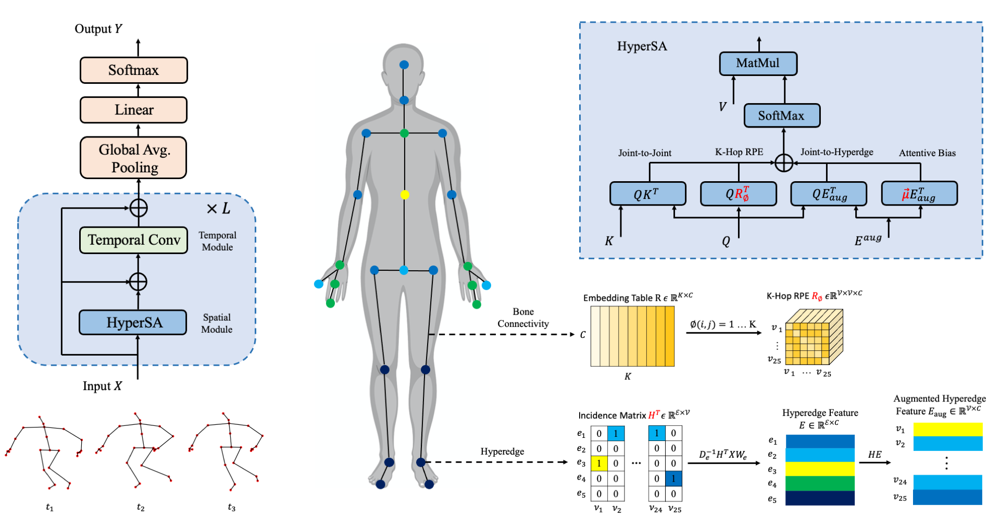

# Hyperformer
This is the official implementation of our paper [Hypergraph Transformer for Skeleton-based Action Recognition.](https://arxiv.org/pdf/2211.09590.pdf)

## Attention on Hypergraph
<p align="center">
   
</p>

## Hyperformer architecture
<p align="center">
   
</p>

# Preparation
### Install torchlight
Run `pip install -e torchlight`

### Download datasets.

#### There are 3 datasets to download:

- NTU RGB+D 60 Skeleton
- NTU RGB+D 120 Skeleton
- NW-UCLA

#### NTU RGB+D 60 and 120

1. Request dataset here: https://rose1.ntu.edu.sg/dataset/actionRecognition
2. Download the skeleton-only datasets:
   1. `nturgbd_skeletons_s001_to_s017.zip` (NTU RGB+D 60)
   2. `nturgbd_skeletons_s018_to_s032.zip` (NTU RGB+D 120)
   3. Extract above files to `./data/nturgbd_raw`

#### NW-UCLA

1. Download dataset from [CTR-GCN](https://github.com/Uason-Chen/CTR-GCN)
2. Move `all_sqe` to `./data/NW-UCLA`

### Data Processing

#### Directory Structure

Put downloaded data into the following directory structure:

```
- data/
  - NW-UCLA/
    - all_sqe
      ... # raw data of NW-UCLA
  - ntu/
  - ntu120/
  - nturgbd_raw/
    - nturgb+d_skeletons/     # from `nturgbd_skeletons_s001_to_s017.zip`
      ...
    - nturgb+d_skeletons120/  # from `nturgbd_skeletons_s018_to_s032.zip`
      ...
```

#### Generating Data

- Generate NTU RGB+D 60 or NTU RGB+D 120 dataset:

```
 cd ./data/ntu # or cd ./data/ntu120
 # Get skeleton of each performer
 python get_raw_skes_data.py
 # Remove the bad skeleton 
 python get_raw_denoised_data.py
 # Transform the skeleton to the center of the first frame
 python seq_transformation.py
```

# Evaluation

We provide the [pretrained model weights](https://github.com/ZhouYuxuanYX/Hyperformer/releases/download/pretrained_weights/hyperformer_pretrained_weights.zip) for NTURGB+D 60 and NTURGB+D 120 benchmarks.

To use the pretrained weights for evaluation, please run the following command:

```
bash evaluate.sh
```

# Training & Testing

### Training

```
bash train.sh
```

Please check the configuration in the config directory.

### Testing

```
bash evaluate.sh
```

To ensemble the results of different modalities, run the following command:

```
bash ensemble.sh
```

## Acknowledgements

This repo is based on [2s-AGCN](https://github.com/lshiwjx/2s-AGCN) and [CTR-GCN](https://github.com/Uason-Chen/CTR-GCN). The data processing is borrowed from [SGN](https://github.com/microsoft/SGN) and [HCN](https://github.com/huguyuehuhu/HCN-pytorch), and the training strategy is based on [InfoGCN](https://github.com/stnoah1/infogcn).

Thanks to the original authors for their work!

## Citation

Please cite this work if you find it useful:
````BibTeX
 @article{zhou2022hypergraph,
  title={Hypergraph Transformer for Skeleton-based Action Recognition},
  author={Zhou, Yuxuan and Cheng, Zhi-Qi and Li, Chao and Geng, Yifeng and Xie, Xuansong and Keuper, Margret},
  journal={arXiv preprint arXiv:2211.09590},
  year={2022}
}
````

# Contact
For any questions, feel free to contact: `zhouyuxuanyx@gmail.com`

